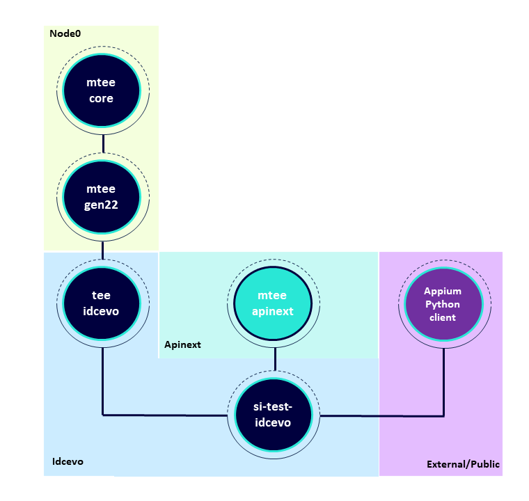
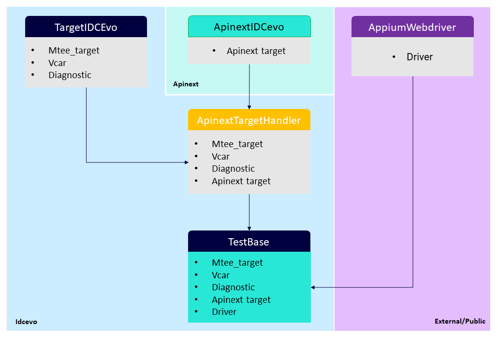

# TestBase class from si-test-idcevo explained

In our repository we have created a TestBase class with the goal of reuse it on every test, this way all the tests will have access to the most used functionalities through it.

## The vision
- Having a reusable test object (the TestBase) which contains most of the enablers necessary for setting up the targets and environment for testing
- Having a separation between the common target enablers and the specific target enablers (apinext enablers - which are meant for android targets) and the appium enablers (for android target that require UI interaction)
- Although all the enablers will be available on TestBase they are meant to be initialized and used only when necessary - this means that all tests can use the TestBase even if they don't need appium, and in those the appium session must not be initialized
- The appium enablers follow a Page Object model approach, meaning all the necessary enablers for navigation and interaction in the UI (Pages) will be placed on objects called Pages. The tests then use the methods of this page object class whenever they need to interact with the UI of that page. 
- The benefit is that if the UI changes for the page, the tests themselves don’t need to change, only the code within the page object needs to change. Subsequently, all changes to support that new UI are located in one place.
- This is achieved by having a BasePage from which every other page will inherit from, and for ease of use, the BasePage, and subsequently all the pages will have the driver, mtee_target and apinext_target available.

## Relation between repos
This is a brief overview of the repos that are dependant for this TestBase to work.

The class is built inheriting the methods from previous classes as well as shown here:

