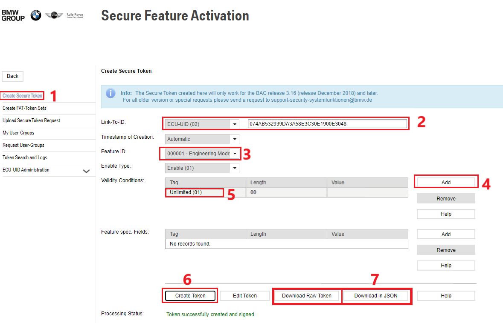

# How to deploy a new IDCEVO worker

The following documentation serves a basis to help on deploying a new IDCEVO/RSE26/CDE local worker on the perspective of a Team Lion member.

It will be demonstrated how to:
- Use certain playbooks from test-farm repository
- Configure network with the necessary vlans
- Setup the environment in order to be used by the team
- Generate SFA and certificates
- Flash the new worker and validate it

## Pre-requirements

To generate SFA you will need to have access to **"ASBC SECURE FEATURE ACTIVATION"** application on B2B.

## Steps overview:

https://jira.cc.bmwgroup.net/browse/IDCEVODEV-166286

- Configure host PC - worker: (Check Lion Onenote for more documentation)
    - Install SSD and RAM
    - Install ubuntu server
    - Create ticket for IT desk to assign a DNS for the worker
    - Collect the schema and the HW
    - Mount everything according to the information above
- Configure worker configs
    - Run test farm ansible (probably with some adaptations)
    - Make sure network configs are in place
        - Vlans
    - Check everything is working as expected
- Setup worker environment
    - Create .netrc
    - Create alias
    - Run test-farm ansible playbook
    - Generate new certificates:
        - SFA and certificates
- Validate
    - Run one test
    - Run one test with mtee
    - Run one job
    - Connect CID and PHUD (if you have)
    - Run vcar
    - Run Appium and connect with Appium Inspector

## Run test farm ansible playbook

To deploy a new local worker, you must consider the follow PR as a basis, https://asc.bmwgroup.net/gerrit/#/c/2589608/, once it will have most of configurations needed.

In order to run the playbooks, you need to install Ansible and the requirements.txt from the test-farm repo in your machine.

### Most important files

- Create a new **idcevo-porto-worker-XX.yaml** with the correct configuration
- Edit **testfarm_hardware_lion_porto.yml** with the roles that you need to run
- Create a new group_var, like **testfarm_hardware_idcevo_lion_porto_c1_B506N.yaml**, if needed in case of being a different version of sample
- Edit **testfarm_gen25** to associate the new worker with group_var

### Playbook check run
This command is ran with check flag on, which means that the playbook will be only tested for errors, if you are successful and everything works properly you can remove the check flag and deploy the change.

```console
ansible-playbook playbooks/testfarm_hardware_lion_porto.yml -vvv --check --vault-password-file ~/ws/tf_pass -i testfarm_gen25
```

When in check mode, some of roles could raise errors that will not happen on normal mode.

### Run lion_setup playbook
To run the playbook to deploy workspaces in the worker, you need to enable the role **lion_setup** on testfarm_hardware_lion_porto.yml and to define which software version will be installed, e.g:
```console
ansible-playbook playbooks/testfarm_hardware_lion_porto.yml -vvv --check --vault-password-file ~/ws/tf_pass -i testfarm_gen25 -e "sw_version=24w26.4-1"
```

This playbook will create:
- workspace with images, repos and venvs directories
- individual workspace directories
- Download repos and create virtual environment for build-tee
- Download and extract artifactory image

## Network configuration

Most of work will be done by the ansible playbook and we need to check if network configurations are in place. Need to validate vlan 68 and 73.

In case of something is wrong with VLANs, to check the configuration of them you can use the command: ```cat /etc/network/interfaces.d/usb-eth0```

If you change anything in **usb-eth0** file, it needs to restart the interface to the changes became effective.

**Tip:** Use vcar to check if VLANs are ok. If the VLANs configuration isn't ok, most probably the vcar wouldn't be able to start correctly.

## Setup worker environment

### Configure .netrc

Copy the **.netrc** from other local worker. This file is needed to download github repositories and artifactory resources.

### Setup alias

Edit the **.bashrc** file with the new aliases. Check with local worker the usual alias commands that we use. Most important are:

- **mtee_venv** - Activate MTEE virtual environment
- **power-on** - Power on supply
- **power-off** - Power off supply
- **remove-using** - Remove files from USING directory
- **rsu_venv** - Activate RSU virtual environment
- **who-is-using** - Check who is using the worker

After editing, execute ```source .bashrc``` to activate the new content of .bashrc.

### Upload worker-scripts

Upload the worker-scripts to /home/tf_admin directory. These files can be found on other workers or you can get from [LSMF repository](https://cc-github.bmwgroup.net/node0/lsmf).

The "generate_csr_request_vX" can be obtained through this [wiki page](https://asc.bmwgroup.net/wiki/pages/viewpage.action?pageId=550686973).

## Generate SFA & certificates

To register the target and to generate SFA, we need to obtain the ECU-UID from the target. Usually this ID is on a sticker on the target but can be found also by using the DOIP tools and in mtee.cfg file. It is a good practice to check if everything matches before starting this step.

Relevant documentation for this chapter:
- [SFA - Secure Feature Activation SP 2021](https://asc.bmwgroup.net/wiki/display/LogandTraceUserInfo/SFA+-+Secure+Feature+Activation+SP+2021#SFASecureFeatureActivationSP2021-GeneratingSFA-Tokens)
- [Generate certificates for SP21 ECUs for Linux users without Esys](https://asc.bmwgroup.net/wiki/pages/viewpage.action?pageId=550686973)
- [Secure Token generation for Secure Feature Activation (SFA) and ECU Modes transitions](https://asc.bmwgroup.net/wiki/display/NODE0/Secure+Token+generation+for+Secure+Feature+Activation+%28SFA%29+and+ECU+Modes+transitions#SecureTokengenerationforSecureFeatureActivation(SFA)andECUModestransitions-Createandinstallatokentoenabletheengineeringmode)


### Register ECU-UID for deployment

To register an ECU for deployment, go to [Requests](https://atc.bmwgroup.net/sd/plugins/servlet/desk/portal/22) and fulfill the form with the corresponding data of ECU.

### Generate SFA

Before generating SFA, you must know the corresponding VIN code and hexadecimal address for the target.

To generate the SFA, you need to access to [ASBC](https://asbc-sfa-emea-proxy-prod.bmwgroup.net/ui/pages/sfa/create.xhtml) page an generate both STK and JSON files.

The STK file is most useful to change manually the target mode with DOIP tools.

Necessary SFA modes:
- Plant mode disable
- Plant mode enable
- Engineering mode disable
- Engineering mode enable

All the files with this information should be uploaded to the worker to the **/home/tf_admin/.config/SFA** and to the test-farm branch.
After uploading to SFA directory, create a symbolic link to this directory on the tf_admin directory.



### Generate certificates

Before starting create a backup on the worker with the files of /var/sysfunc directory from the target to /home/tf_admin/var_sys_backup.

After generating the SFA, you can start to generate certificates. To do this, follow these [steps](https://asc.bmwgroup.net/wiki/pages/viewpage.action?pageId=550686973). **Important: This need to be done on engineering mode.**

Please take the consideration that IDCEVO use DOIP instead of HSFZ so we need to find the corresponding script on DOIP tools.

After this, backup again the /var/sysfunc data to var_sys_backup.

## Flash and validate new worker

To flash the worker, please check the follow tutorial: [4.9) Execute TEE tests on worker](https://asc.bmwgroup.net/wiki/display/IDCEVO/4.9%29+Execute+TEE+tests+on+worker).

After updating the target with a new image, validate if is possible to run a job with mtee and also if the vcar works independently.

## Links
For more documentation, please check:

- https://criticaltechworks-my.sharepoint.com/:p:/r/personal/ctw01036_criticaltechworks_com/_layouts/15/Doc.aspx?sourcedoc=%7B24527881-4FEC-4068-BB7F-7738F3ED71A4%7D&file=lion_onboarding_peek_under_the_hood.pptx&action=edit&mobileredirect=true
- https://cc-github.bmwgroup.net/pages/TestAndValidation/vogon-knowledge-base/pages/tutorial-worker-arrival.html#possible-sfa-errors
- https://asc.bmwgroup.net/wiki/pages/viewpage.action?pageId=550686973
- https://asc.bmwgroup.net/wiki/display/LogandTraceUserInfo/SFA+-+Secure+Feature+Activation+SP+2021