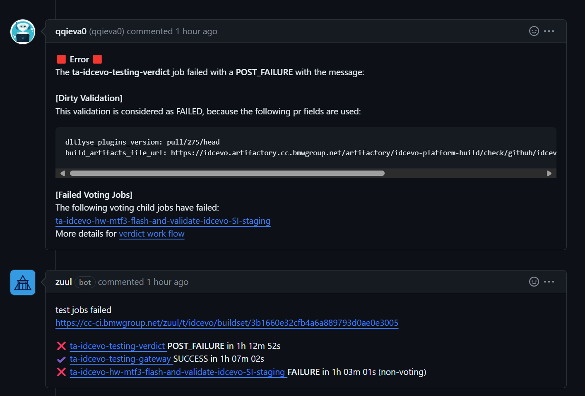

# How to test external repositories

## How to test a dirty image

The steps to run SI tests on a dirty image are:

1. After having a valid dirty build, you need to obtain the link for the build_artifacts.yaml, like for example:
    ```
        https://idcevo.artifactory.cc.bmwgroup.net/artifactory/idcevo-platform-build-fg/check/github/idcevo/meta-idcevo/3555/2024-05-07-00-42-30/build_artifacts.yaml
    ```

2. After this, we can choose between two paths:
    - Set a pin, **ta_build_artifacts_file_url**, on the PR description without the quotes
        * Example: [Dirty pins PR example](https://cc-github.bmwgroup.net/idcevo/si-test-idcevo/pull/970)
    - Define the variable **build_artifacts_file_url** on test.yaml
        * Example:
            ```yaml
            build_artifacts_file_url: https://idcevo.artifactory.cc.bmwgroup.net/artifactory/idcevo-platform-build-fg/check/github/idcevo/meta-idcevo/3555/2024-05-07-00-42-30/build_artifacts.yaml
            ```

3. To run correctly and to use Test-Automation dirty pins, define test.yaml as the follow example:
    ```yaml
    - project:
        test:
            jobs:
                - ta-idcevo-testing-verdict
                - ta-idcevo-testing-gateway:
                    dependencies:
                    - ta-idcevo-testing-verdict
                - ta-idcevo-hw-mtf3-flash-and-validate-idcevo-SI-staging:
                    voting: false
                    dependencies:
                    - ta-idcevo-testing-gateway
    ```
    The **ta-idcevo-testing-gateway** job is necessary to guarantee that all supported dirty pins are parsed correctly and used during the test run.

4. Write 'retest' as comment on the PR and the job will be added to the queue to start running. Example: [ex_pr_topic_build](https://cc-github.bmwgroup.net/idcevo/si-test-idcevo/pull/616)

5. After the test run finished it will be published on PR the results:

Although it is saying that this validation is considered as **Failed**, please check the results obtained in the test job.
The jobs that use one (or more) options/variables that have the "NOTE: generate dirty validation." will always have the verdict of "FAIL".


## How to test with dirty pins

Currently, we support specifying custom versions for the following toolchains and TEE variables:

- **MTEE Core**

    PR field to add: `ta_mtee_core_version: <commit_id>`

- **MTEE Core container image version (generated from MTEE Core and extra goodies)**

    PR field to add: `ta_mtee_base_version: <staging_version | another_official_version>`

- **MTEE Gen22**

    PR field to add: `ta_mtee_gen22_version: <commit_id>`

- **MTEE APINExt**

    PR field to add: `ta_mtee_apinext_repo_version: <commit_id | branch name>`

- **tee-idcevo**

    PR field to add: `ta_tee_idcevo_version: <commit_id | branch_name>`

- **Diagnose library**

    PR field to add: `ta_diagnose_version: <commit_id>`

- **DLTLyse**

    PR field to add: `ta_dltlyse_core_version: <commit_id>`

- **DLTLyse plugins version**

    PR field to add: `ta_dltlyse_plugins_version: <commit_id>`

- **VCar container image version**

    PR field to add: `ta_vcar_version: <staging_version | another_official_version>`

- **Test suite**

    PR field to add: `ta_tee_test_suite: <test_suite_name>`

- **Dirty build**

    PR field to add: `ta_build_artifacts_file_url: <build_artifacts_link>`

- **BAT automation test system software**

    PR field to add: `bat_automation_tests_systemsw_version: <commit_id>`

- **BAT automation test**

    PR field to add: `bat_automation_tests_version: <commit_id>`

- **Deletion handler**

    PR field to add: `deletion_handler_version: <commit_id>`

- **Metric-collector**

    PR field to add: `metric_collector_package_version: <tag>`

    PR field to add: `metric_collector_index_url_default: <link>`

    If using a dev tag, you should use *https://common.artifactory.cc.bmwgroup.net/artifactory/api/pypi/software-factory-pypi-dev/simple* as **metric_collector_index_url_default**

- **RSU-flasher**

    PR field to add: `rsu_flasher_tool_version: <commit_id>`

- **Sysman-testing**

    PR field to add: `sysman_testing_version: <commit_id>`


Then, run *test pipeline*, and all given custom versions will be populated to all test jobs.

*PS: no quote should be used for all values.*

## How to test changes in reporting repo (software-factory/validation-python-metrics-collector)

1. Having a PR on the reporting repo with the changes, i.e., [example_pr](https://cc-github.bmwgroup.net/software-factory/validation-python-metrics-collector/pull/37)

2. The PR will run some automatic jobs and, to have the current version of the repository in a pypi package in artifactory, you need to write 'retest' in the PR, i.e., [example_upload_job](https://cc-github.bmwgroup.net/software-factory/validation-python-metrics-collector/pull/37#issuecomment-8974769)

3. This job will output a message with the name of version and the link to the artifactory where it was published, i.e., [example_output](https://cc-github.bmwgroup.net/software-factory/validation-python-metrics-collector/pull/37#issuecomment-8974769)

4. To use the uploaded version you need the version tag. Taking the example of the previous step, you need to know the "1.2.1.dev3+4cf69f65"

5. To use this version on a SI PR you need to redefine two variables. The index url to search the package should point to the 'dev' folder, and the version should point to the one from the previous step. Please also check the above section in this page (How to test with dirty pins). These variables are:

    * **metric_collector_index_url_default** which should point to: https://common.artifactory.cc.bmwgroup.net/artifactory/api/pypi/software-factory-pypi-dev/simple
    * **metric_collector_package_version** which should point to the version tag

6. The final step is to write a comment in the PR with **retest** to trigger the edited job in the previous step


## How to create a new tag in: software-factory/validation-python-metrics-collector repo

1. Once your PR is merged into the repository, you'll need to create a new tag to include your changes in our repository (si-test-idcevo). To create the new tag, you must follow the Tag Release mentioned here: [swf_validation_python_metrics_collector_tag_release](https://cc-github.bmwgroup.net/software-factory/validation-python-metrics-collector#tag-release)

2. If you want to create the tag for your master, first check out to master and then:

```bash
git tag -a tag_name -m "Tagging message"
```

3. Check if it's created or not:

```bash
git tag
```

4. Push your tag in the remote repository (software-factory/validation-python-metrics-collector repo)

```bash
git push <remote> tag_name
```

5. The newly created tag must appear in: [tags](https://cc-github.bmwgroup.net/software-factory/validation-python-metrics-collector/tags)

6. The final step is to change the following line in [package_version](https://cc-github.bmwgroup.net/idcevo/si-test-idcevo/blob/master/roles/ensure-testing-reporting/defaults/main.yaml#L2) to download the correct version of the metric collector package
