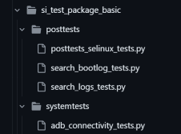

# How to test with TRAAS on si-test-idcevo

This page provides a guidance for how to run IDCEVO automated tests with TRAAS and it will explain the follow contents:
 - How to create a new job
 - How to create a new test suite
 - How to create a new test package
 - Test package and test script structure
 - How to define which DLTlyse plugins and metric collector will be used
 - How to use a dirty build
 - How to run new tests or new tests packages by using zuul pipelines

## Write a new job

1. Before start creating a new job, you should create a new test plan on Jira. Therefore it will be possible to send the job results to Jira via xray tools and the test plan will be associated with every test executions related with this job.

2. After creating a test plan, you need to add it on [job_config_si_idcevo.yaml](https://cc-github.bmwgroup.net/idcevo/si-test-idcevo/blob/master/playbooks/reporting/files/job_config_si_idcevo.yaml) where you will give a name to the job, like for example:

```yaml
ee25-traas-SI-Perso:
    <<: *base_si_tests_idcevo
    test_plan_key: IDCEVODEV-279767
```

3. Add the new job to the [jobs-traas.yaml](https://cc-github.bmwgroup.net/idcevo/si-test-idcevo/blob/master/zuul.d/jobs/jobs-traas.yaml) with required configuration. Be careful that your job to run properly on TRAAS must be always dependent of **ta-hw-traas-idcevo-base** job otherwise it will not run on TRAAS.

Example:
```yaml
- job:
    name: ee25-traas-SI-Perso
    parent: ta-hw-traas-idcevo-base
    timeout: 21600  # 6h Zuul job timeout
    vars:
      duration: 120  # TRAAS session duration in minutes (2h)
      product_type: idcevo
      artifactory_repo: idcevo-nightly
      rack_tags: Rack_COCO_020 # Rack_CTW_CR_007
      test_suite: "SI-perso-traas"
      test_packages: "all"
      flash_dev_full: "false" # Don't DEV flash CTW racks. It will break them.
      flash_pdx: "false"
      run_mtee_suite: "true"
      export_test_dir: "{{ zuul_root_dir }}/src/cc-github.bmwgroup.net/idcevo/si-test-idcevo"
      test_dir: "custom_repos"
      test_scripts: "{{ test_dir }}/si-test-idcevo/si_test_idcevo/si_test_package_perso/systemtests"
      run_mtee_custom: "true"
      executor_version: ""
      extra_prepare_actions: >
        prepare:prepare_pdx_any;
        tee25:flash_target;
        tee25:custom_install_from_upload:{{ test_dir }}/si-test-idcevo;
        tee25:prepare_si_test_suites;
```

4. Add your job to pipeline at [si-test-idcevo pipelines](https://cc-github.bmwgroup.net/idcevo/si-test-idcevo/tree/master/zuul.d/pipelines).

### TRAAS job variables

TRAAS jobs already has some predefined variables like for example:

- **duration:** Maximum duration of TRAAS session. This is different from **timeout** variable which is duration of TRAAS session plus the scheduling time.
- **rack_tags:** Specify the tag of the rack. This tag needs to be associated with SITA group. Any doubt about this or if you need any new tag, please contact CTW traas team.
- **test_suite:** Which test suite will be ran on this job
- **executor_version:** Define TRAAS build. For a regular usage, this is not important, only required to define if there is any change on TRAAS framework that is still on development that is needed to use in your test
- **run_mtee_suite:** Execute SI test
- **extra_prepare_actions:** TRAAS actions that will be executed as soon the session starts

If you are changing/adding tests to this repository and you want to test on github PR, you need to define the follow variables:
- **export_test_dir** as "{{ zuul_root_dir }}/src/cc-github.bmwgroup.net/idcevo/si-test-idcevo"
- **test_dir** as "custom_repos"
- **test_scripts:** please check the previous example to know what you need to define (Legacy on EE25 - don't have impact on how system works however it needs to be set)

### TRAAS actions
To know more about TRAAS actions, please check on [TRAAS USAGE](https://cc-github.bmwgroup.net/marcoavsilva/traas/blob/main/Documentation/UseTRAAS.md) and [TRAAS Developer docs](https://developer.bmwgroup.net/docs/traas/)


## Create a new test suite

To deploy a new test suite, you need to create at least four files on [test suite directory](https://cc-github.bmwgroup.net/idcevo/si-test-idcevo/tree/master/test-suites/idcevo). Be aware that you need to create a test suite for the desired ECU. For example, if you need to have a job for IDCEVO and other for CDE, you need to create a test suite in each ECU.

The files must follow a specific nomenclature, for example if we're a creating a new test suite called **SI-perso-traas**:
- **SI-perso-traas**
    - Add test suite filters. The file can be empty or can add multiple filters as many as you want. This will filter tests and will only execute the tests that contain the test suite on metadata.
        ```
        -a testsuite=SI-perso
        ```
- **SI-perso-traas-dltlyse-plugins**
    - Define the plugins to be ran on the job
- **SI-perso-traas-posttests-idcevo**
    - Define the posttests to be ran on the job
- **SI-perso-traas-systemtests-idcevo**
    - Define the systemtests to be ran on the job

## Create a new test package and add new tests

To create a new test package you just need to create a new directory inside [si_test_idcevo folder](https://cc-github.bmwgroup.net/idcevo/si-test-idcevo/tree/master/si_test_idcevo). Directory must need to start with **si_test_package_**

### Test package structure

Inside test package directory must exist also two other directories, **systemtests** and **posttests**.
Here is were you can add your tests. Be aware that test script must end on **"_tests.py"** in order to be executed by TEE framework.



After setting the test package and the test scripts, you need to add the new test package on [tests-config.yaml.j2](https://cc-github.bmwgroup.net/idcevo/si-test-idcevo/blob/master/playbooks/build-tee-test-config/templates/tests-config.yaml.j2) as below by replacing ***<test_package_name>*** with the test package name.

```
# System test
- from: "si_test_idcevo/si_test_config/{{ product_type }}_config.ini"
  to: si-test-idcevo/<test_package_name>/systemtests/features_config.ini

#Post test
- from: "si_test_idcevo/si_test_config/{{ product_type }}_config.ini"
  to: si-test-idcevo/<test_package_name>/posttests/features_config.ini
```

## DLTlyse plugins

To add DLTlyse plugins to the new test suite, you just need to define them on the corresponding test suite dltlyse file. For example, on **SI-perso-traas** test suite, you need to define them on the **SI-perso-traas-dltlyse-plugins** file.

The framework itself will run these dltlyse plugins and retrieve the relevant information based on plugins enabled. A dedicated directory will be created by the framework with the output of the plugins that you can access as soon the job ends.

## Metric collector

If you want to collect metrics and send them to grafana, for example, you need to define the metrics collectors on [collector_suites.yaml](https://cc-github.bmwgroup.net/idcevo/si-test-idcevo/blob/master/playbooks/reporting/vars/collector_suites.yaml).

```yaml
SI-PERSO-TRAAS:
    - "MetricCollectorLogMetrics"
    - "MetricCollectorJobDuration"
```

After configuring the metric collectors, you need to set **kpi_upload** variable as **true** in the job configuration.

## How to use dirty builds on TRAAS job

To use a dirty build for IDCEVO or even ICON, you need to prepare the respective workspace on TRAAS with the artifacts of the dirty.

For example, to use a dirty build for ICON you need to define an extra prepare action to prepare workspace for ICON pointing to dirty build artifacts, set branch as *check* and also sending the flash action.

The same goes for IDCEVO, the only thing that change are the actions as you can see below.

E.g:
```yaml
icon_branch: "check"
icon_version: "check/master/iconicc/meta-icon-bam/10516/2025-01-24T150021Z-534b8caff0f5409391576fa018d9af48"
idcevo_branch: "check"
idcevo_version: "github/idcevo/meta-idcevo/8223/2025-02-07-16-10-20"
extra_prepare_actions: >
    prepare:prepare_workspace_icon:branch={{ icon_branch }}:gl_folder={{ icon_version }};
    tee25:flash_target_icon;
    prepare:prepare_workspace:branch={{ idcevo_branch }}:gl_folder={{ idcevo_version }};
    tee25:flash_target;
```
