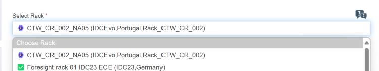

# TRAAS workshop - module 2

This files serves as a guide for the module 2 of the TRAAS workshops.

Firstly, we will explore TRAAS framework/interface and how to use it.

In the second part, we will create:
- A test and execute it on TRAAS
- A plugin and execute it locally

## TRAAS usage

### How to schedule a session

To schedule a session, go to [TRAAS homepage](https://traas.bmwgroup.net/) and click on the **Schedule** button.

Select any IDCevo rack:



**Note:**
- Sometimes the IDCEVO racks don't show up at the first time. When this happens, please refresh or clear the cookies on the website. Even so if they don't appear after several refreshes, please wait a few minutes and try again.

Fulfill the fields on the form. Only the date and time slot are obligatory, all the others are optional.


#### Startup actions

On the startup actions, you can define every action that you want to run as soon as the rack is prepared. By default, the **prepare_workspace** action is already defined, which is recommended to be executed.

### TRAAS session symbols
After scheduling a session you will be redirected to a page with your session where you can see the details of the session, edit session, delete it and most important the link to access the session.
To enter in your session, press the dark blue rocket ship button.

More information available on: [Starting section symbols](https://developer.bmw.com/docs/traas/getting-started/#starting-the-session)


### Is your session ready and action status?

After you book a rack, the session will take some minutes to start and if you try to access it before, you'll see a white page with the warning "Requested executor session is not currently active". Wait a few minutes and that will clear up.

As soon as the session starts, the startup actions will be triggered and you can check their current status on the **Connection status** button.

- **Green**: All features are available and there isn't any action on queue.
- **Orange**: Some tasks are still in the queue and any new action will be added to it.
- **Red**: The session ended or the connection between your browser and rack is lost.


More detailed information on: [Connection Status](https://developer.bmw.com/docs/traas/explore/test_session_explore/test_session_main_explore/#connection-status)

### Is the target on?

Sometimes when you schedule a session, depending on how the previous session ended and which actions were triggered, the rack can be turned off. To turn on the rack, you just need to click on the
**On/Off** button. With this button, you can also trigger a reboot and therefore a new lifecycle.

More information on: [Main power switch](https://developer.bmw.com/docs/traas/explore/test_session_explore/test_session_main_explore/#header48)

### Take a screenshot

To take a screenshot of the current display, click on the camera button on the **Screenshot/XML results** menu.


More information on: [How to take a screenshot?](https://developer.bmw.com/docs/traas/explore/test_session_explore/test_session_main_explore/#screenshots)

### How to check the version that is flashed?

You have two ways of checking the version of installed software, e.g. on IDCevo, they are:
- Execute a test with the command **cat /etc/os-release**.
```python
import logging

from mtee.testing.support.target_share import TargetShare as TargetShareMTEE

logger = logging.getLogger(__name__)  # pylint: disable=invalid-name

class TestTraasDemo:

    @classmethod
    def setup_class(cls):
        cls.target = TargetShareMTEE().target # Instantiate the Node0 TargetShare class

    def test_001_idcevo_os_information(self):
        return_stdout, _, _ = self.target.execute_command("cat /etc/os-release")
        logger.info(f"OS-release Output: {return_stdout}")
```

- Establish a SSH connection to the target(HU) and execute the previous command:


### How to PDX flash and how to use a dirty PDX?

To flash the HU with an official release, you just need to prepare the workspace with the release, prepare PDX and then select the option of PDX flashing.


Besides flashing with an official release, we can also flash with a dirty build. However when flashing with a dirty PDX, we can only flash Node0 and Android at separated times.
[Flash TRAAS documentation link](https://developer.bmw.com/docs/traas/explore/test_session_explore/test_session_main_explore/#changing-the-software-version-mid-session-)

#### Node0

To see how to flash IDCevo/Node0, please check [Flashing from a dirty build idcevo/node0](https://developer.bmw.com/docs/traas/explore/test_session_explore/developer_testing/#flashing-from-a-dirty-build-idcevonode0)

#### Android
To see how to flash IDCevo/Android, please check [Flashing from a dirty build idcevo/android](https://developer.bmw.com/docs/traas/explore/test_session_explore/developer_testing/#flashing-from-a-dirty-build-idcevoandroid)

---

## Create a test

Before creating a new test, take a look on this [example test](https://cc-github.bmwgroup.net/idcevo/test-automation/blob/master/tests/mtee_system_tests/example_tests.py). Check how we can interact with both Node0 and Android components and how to execute commands.

### Challenge

- Create a test that will validate boot complete message in DLT.

    Message details:

       - APID: "SYS"
       - CTID: "JOUR"
       - Regex: ".*MARKER KPI - kernel_init Done.*"

    Useful links:

    - How to filter DLT messages with DLTContext: [Appium_handler.py](https://cc-github.bmwgroup.net/idcevo/si-test-idcevo/blob/be02746feb3211aecae50009f72066de2641ce9a/si_test_idcevo/si_test_helpers/appium_handler.py#L153-L174)

- Create a test that waits for android boot complete and take a screenshot.

    Useful links:

    - How to wait for Android boot completion: [User_switch_evo_tests.py](https://cc-github.bmwgroup.net/idcevo/si-test-idcevo/blob/be02746feb3211aecae50009f72066de2641ce9a/si_test_idcevo/si_test_package_android/systemtests/user_switch_evo_tests.py#L31)
    - How to take a screenshot:
        - [phud_ui_tests.py](https://cc-github.bmwgroup.net/idcevo/si-test-idcevo/blob/be02746feb3211aecae50009f72066de2641ce9a/si_test_idcevo/si_test_package_phud/systemtests/phud_ui_tests.py#L168)
        - [Apinext_target_handlers.py](https://cc-github.bmwgroup.net/idcevo/si-test-idcevo/blob/be02746feb3211aecae50009f72066de2641ce9a/si_test_idcevo/si_test_helpers/apinext_target_handlers.py#L102-L114)


## Create a dltlyse plugin

Some of the most important aspects to take in consideration when developing a new plugin:

- **message_filters**: Message filters by APID and CTID fields
- **__call__()**: Callback function that will be used by the framework when detecting a message that meets the **message_filters**
- **new_lifecyle()**: Function executed in the beginning of every lifecycle
- **end_lifecycle()**: Function executed by the end of every lifecycle

### Challenge

- **Do you have any message or a set of messages that you want to validate?**
- Otherwise create a plugin to validate performance messages of boot completion. Check [dlt_filter_idcevo.json](https://cc-github.bmwgroup.net/node0/dltlyse-plugins-gen22/blob/master/dltlyse_plugins_gen22/plugins_gen22/data/DLTBootchart/dlt_filter_idcevo.json) to check possible filters and regex patterns to use in your plugin.

    Examples:

    - [CPULoadTimestampCheck](https://cc-github.bmwgroup.net/node0/dltlyse-plugins-gen22/blob/master/dltlyse_plugins_gen22/plugins/cpu_load_timestamp.py)
    - [DLTBootchartPlugin](https://cc-github.bmwgroup.net/node0/dltlyse-plugins-gen22/blob/master/dltlyse_plugins_gen22/plugins_gen22/dlt_bootchart.py)
    - [DLTMsgInterestPlugin](https://cc-github.bmwgroup.net/node0/dltlyse-plugins-gen22/blob/master/dltlyse_plugins_gen22/plugins_gen22/dlt_messages_of_interest.py)
